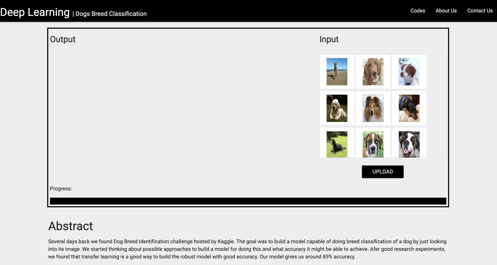

## Run Instructions



```
$ virtualenv venv
$ source venv/bin/activate
$ git clone https://github.com/harshul1610/DeepLearning-Playground.ai.git
$ cd DeepLearningDemos.ai
$ pip install -r requirements.txt
$ cd webapp
$ python manage.py runserver


$ screen -S redis-server
$ redis-server

$ screen -S celery-beat
$ cd webapp
$ celery -A webapp beat -l info

$ screen -S celery-worker
$ cd webapp
$ celery -A webapp worker -l info
```

## LICENSE

MIT
